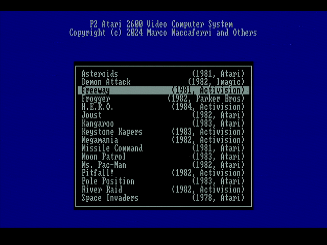
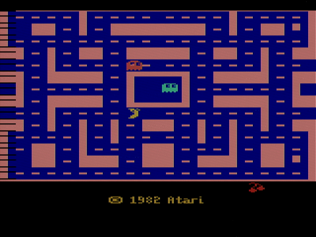
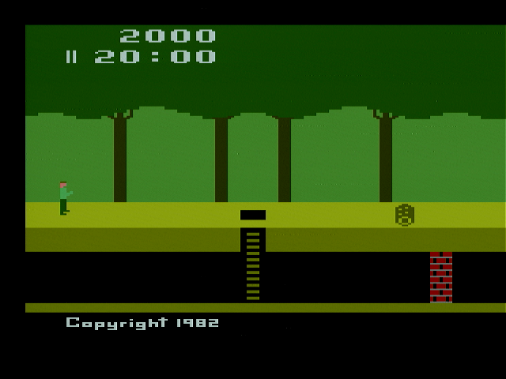
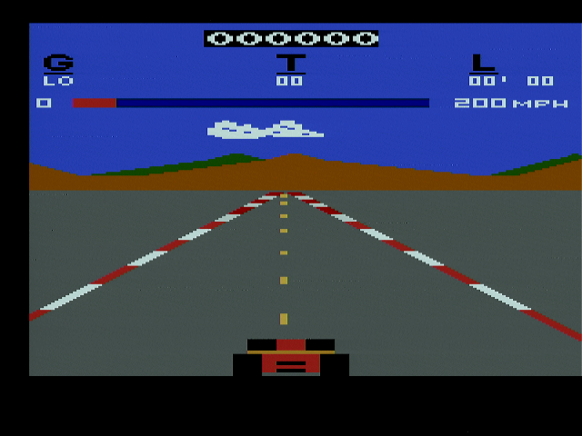
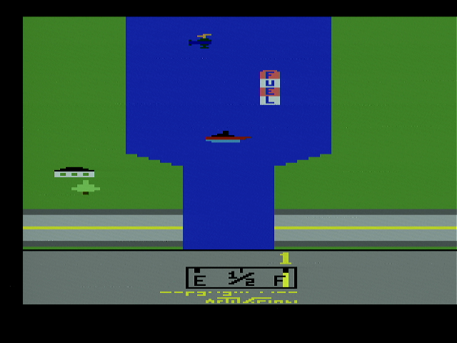
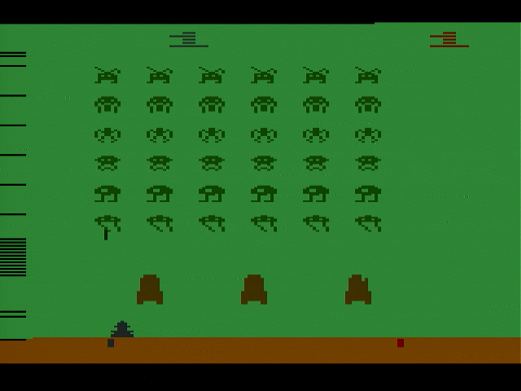

## Atari 2600 Video Computer System Emulator

This is the Atari 2600 VCS emulator for the P2.

Available in two versions:

 * **[Atari2600.spin2](Atari2600.spin2)** - Complete Spin2 version with multi-cartridge selection menu, keyboard and USB gamepad controllers support. Can be compiled with Spin Tools IDE
 * **[atari_2600.spin2](atari_2600.spin2)** - PASM-only version with single cartridge support and limited USB gamepad controllers support. Can be compiled with PNut.

**Menu Controls**

 * **UP / DOWN** - Change selection
 * **ENTER** - Run selected cartridge

**In Game Keyboard Controls**

 * **F1** - Select
 * **F2** - Reset
 * **F3** - Color TV
 * **F4** - B&W TV
 * **F5** - Left Difficulty A
 * **F6** - Left Difficulty B
 * **F7** - Right Difficulty A
 * **F8** - Right Difficulty B
 * **Arrows** - Left Joystick direction
 * **CTRL / SPACE** - Left Joystick button
 * **ESC** - Open cartridge selection menu

Supports USB Gamepad controllers for left/right players.
Pressing **SELECT + START** buttons at the same time opens the cartridge selection menu. Use the direction hat to select the game and press **A, B, X or Y** button to run the selected game.

**Screenshots**

  
  
  
  
  
  

**Note** The emulation is almost complete but not 100% accurate. Several games runs fine but some may show incorrect graphics objects due to the absence of the TIA delay queue.

All trademarks are property of their respective owners.
